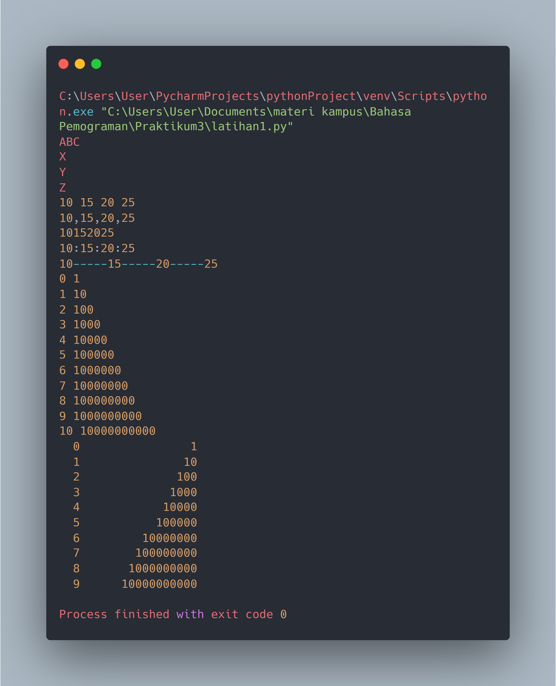
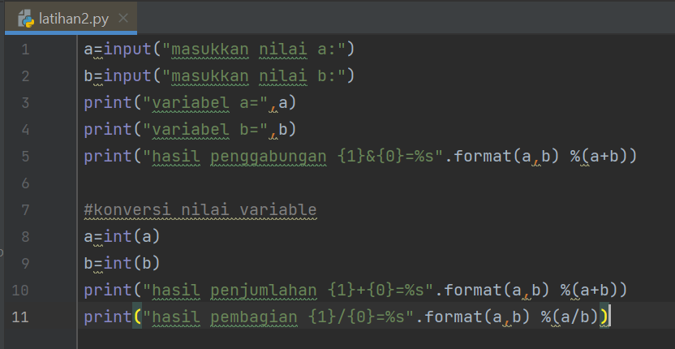

# <b>Latihan 1</b>

##  Hasil Run Code: 

# <b>Latihan 2</b>

##  Hasil Run Code: 

# <b>Latihan 3 "Membuat kode program menggunakan string formating untuk menghasilkan output seperti pada gambar dibawah ini.</b>

# <b>Buat kode program untuk menghitung luas dan keliling lingkaran menggunakan Python.</b>

##  Source Code 

##  Hasil Run Code: 

## Pembahasan

1. Kita deklarasikan variabel pi = 22/7, secara otomatis menggunakan tipe data float karena bernilai desimal.
2. Kemudian diminta memasukan nilai Jari-jari (r), inputan dibungkus float agar nanti perhitungan dapat mengoprasikan nilai desimal.
3. Mengimplementasikan Rumus Luas dan Keliling yang sudah saya berikan kedalam sebuah codingan.
4. Cetak memakai "{:.3f}".format(luas) kenapa? penambahan "{:.3f}".format(), membatasi 3 karakter dibelakang koma.
